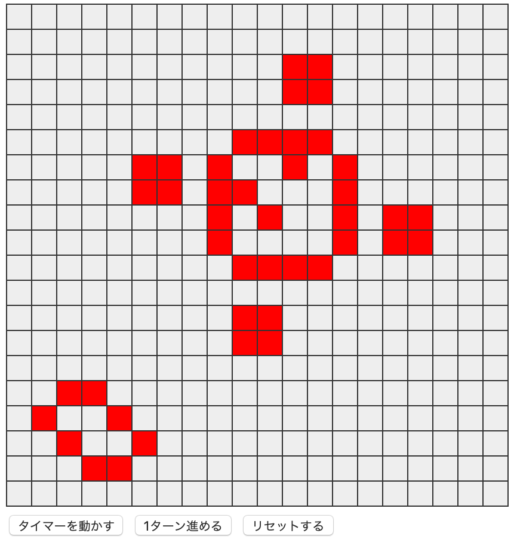

# svelte3-web-components

このリポジトリーは、技術書典10「[いまからはじめる Svelte3](https://techbookfest.org/product/4925576424980480?productVariantID=5094401858600960)」第２章のサンプルコードです。



## サンプルコードの試しかた

リポジトリーをクローンしたら、npmパッケージをインストールします。

```bash
cd svelte3-web-components
npm install
```

そして、[Rollup](https://rollupjs.org)のモジュール・バンドル処理を実行し...

```bash
npm run dev
```

ウェブブラウザーで[localhost:5000](http://localhost:5000)にアクセスします。
